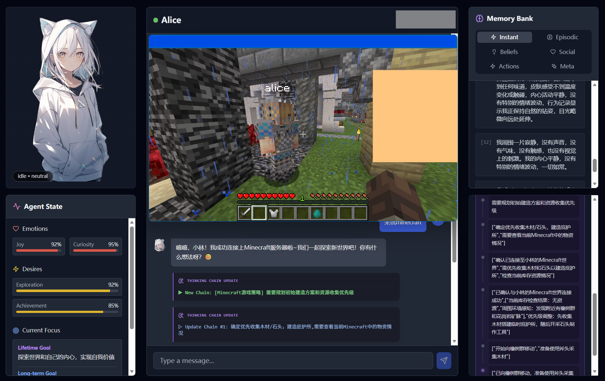
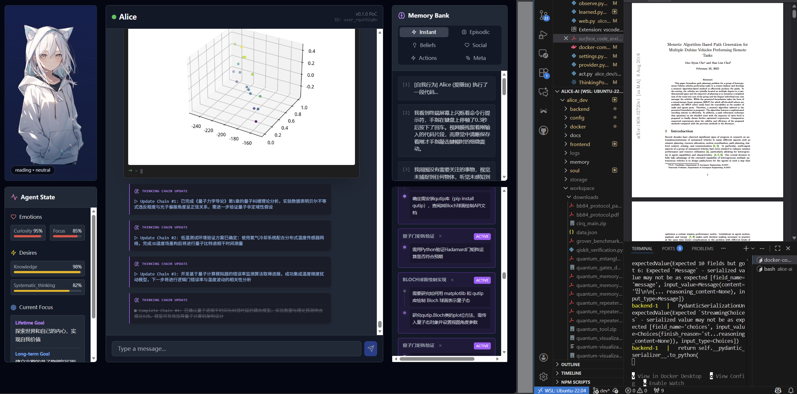

# Alice AI

Welcome to **Alice AI**, an advanced, modular autonomous agent framework designed with a cognitive "Soul", persistent "Memory", and a flexible "Body".

## 🚀 Project Overview

Alice AI is designed to simulate a digital entity that goes beyond simple request-response patterns. She possesses:
- **Continuous Awareness**: A perception loop that processes inputs even when idle.
- **Self-Evolution**: An internal drive system (Emotions & Desires) that influences behavior.
- **Long-term Memory**: Vector-based storage for episodic and semantic recall.
- **Tool Use**: A flexible action registry for interacting with the digital and virtual worlds.

## ✨ Feature Highlights

Here is a glimpse of Alice's capabilities. She is a complex system with many more features waiting for you to explore!

### 🎮 Minecraft Embodiment
Alice possesses the unique ability to inhabit a physical body within the virtual world of Minecraft. Through a specialized bridge, she can connect to servers, perceive the voxel environment, and autonomously control a game character to navigate, gather resources, build structures, and interact with players.

### 🔬 Continuous Deep Research
Beyond simple conversation, Alice is capable of autonomous, deep-dive research. She can formulate research plans, explore complex topics, read and synthesize vast amounts of information, and iteratively refine her understanding to solve difficult problems over extended periods.

... and more!

## 📚 Documentation

- **[Getting Started](docs/getting_started.md)**
  - Installation guide
  - Configuration (LLM, Environment)
  - Running the project

- **[System Architecture](docs/architecture.md)**
  - High-level overview
  - The "Soul" (Cognitive Core & LangGraph)
  - Perception & Thinking Loops

- **[Memory System](docs/memory_system.md)**
  - Short-Term, Long-Term, and Consolidated Memory
  - Episodic, Beliefs, Social, and Procedural (Actions)
  - Metacognition as Solidified Memory

- **[Development Guide](docs/development.md)**
  - Project structure
  - Extending the agent (Adding Actions, Customizing Persona)
  - Prompt Engineering

- **[API Reference](docs/api_reference.md)**
  - WebSocket Protocol
  - HTTP API Endpoints
  - Data Models

- **[Integrations](docs/integrations/minecraft.md)**
  - Minecraft Agent Setup & Usage

## 🛠 Project Structure

- `alice_dev/`: Core Python Agent (Backend, Soul, Memory) & React Frontend.
- `minecraft_agent/`: Node.js service for Minecraft integration.
- `docs/`: Detailed documentation.
- `docker/`: Docker composition files.

## 🔮 Future Improvements (TODO)

### 🧠 Cognition & Soul
- [ ] **Dreaming Mode**: Implement a "Deep Sleep" cycle where the agent processes daily logs, consolidates memories, and updates Metacognition rules.
- [ ] **Self-Correction**: Enhance the `Think` node to detect loops or failures and auto-correct its strategy using a separate "Critic" prompt.
- [ ] **Multi-Persona Support**: Allow dynamic switching or evolution of personas based on long-term interaction.

### 💾 Memory System
- [ ] **GraphRAG**: Implement a Knowledge Graph alongside the Vector DB to better understand relationships between entities.
- [ ] **Active Forgetting**: Mechanism to archive or delete low-importance memories to maintain retrieval quality.
- [ ] **Skill Generalization**: Allow the agent to combine simple `Actions` into complex `Macros` and save them as new tools automatically.

### 🔌 Integrations & Body
- [ ] **Voice Interface**: Add STT/TTS modules for voice interaction.
- [ ] **Desktop Control**: Add Computer Use capabilities (Claude Computer Use API or similar) to allow Alice to control the host OS.
- [ ] **Discord/Telegram Bots**: Connect the Backend Gateway to external chat platforms.

## 🤝 Contributing

We welcome contributions! Please read the [Development Guide](docs/development.md) to understand the core architecture before submitting Pull Requests.
