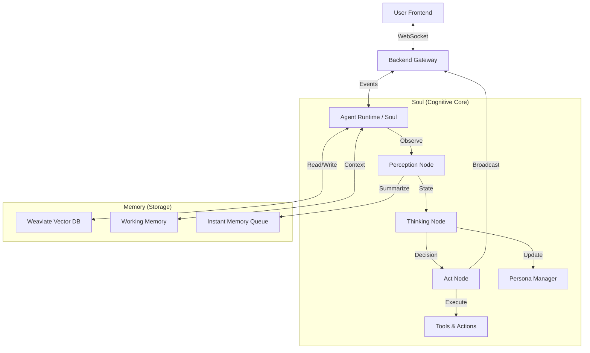

# System Architecture

## Overview

Alice AI is a modular autonomous agent system designed to simulate a digital entity with a "Soul" (cognitive core), "Memory" (storage), and a "Body" (Backend/Frontend interface).

## High-Level Data Flow

## Core Components

### 1. The Soul (Cognitive Core)
Located in `alice_dev/soul/`, this is the brain of the agent, implemented using **LangGraph**.

#### The Thinking Loop
The agent runs a continuous state machine loop: `START -> Observe -> Think -> Act -> END`.

1.  **Observe Node (`soul/nodes/observe.py`)**:
    -   **Input**: User messages, system events, or silence.
    -   **Process**: 
        -   Buffers raw sensory input.
        -   Uses a lightweight LLM (Perception Model) to summarize the buffer into **Instant Memory**.
        -   Performs **Subconscious Association**: Automatically triggers `Associate` or `Recall` actions based on input content to retrieve relevant Long-Term Memories.
    -   **Output**: Updated `AgentState` with new memories and perception summary.

2.  **Think Node (`soul/nodes/think.py`)**:
    -   **Input**: Context (History), Instant Memory, Persona State (Emotions/Desires), Retrieved Memories.
    -   **Process**: 
        -   The Main LLM (Reasoning Model) analyzes the situation.
        -   Updates internal state (Emotions, Desires, Goals).
        -   Manages the **Thinking Pool** (Long-term thought threads).
        -   Generates an **Action Queue** (Plan).
    -   **Output**: A structured JSON plan containing state updates and actions.

3.  **Act Node (`soul/nodes/act.py`)**:
    -   **Input**: Action Queue.
    -   **Process**: 
        -   Executes actions sequentially from the `ActionRegistry`.
        -   Broadcasts status updates (Pending -> Executing -> Completed) to the frontend.
        -   Feeds action results back into the Perception system (Self-Awareness).

### 2. Memory Systems
Located in `alice_dev/memory/`.

#### Long-Term Memory (Weaviate)
-   **Episodic Memory**: Stores past interactions and events.
-   **Semantic Memory**: Stores facts and knowledge.
-   **Cognitive Memory**: Stores beliefs and thought chains.
-   **Retrieval**: Uses vector similarity search (embeddings) to find relevant memories based on current context.

#### Working Memory (In-Memory)
-   **Perception Buffer**: Accumulates raw inputs before summarization.
-   **Instant Memory Queue**: A FIFO queue (size ~10) of summarized recent events. This represents the agent's "stream of consciousness".
-   **Context Window**: The recent chat history fed to the LLM.

### 3. Persona System
Located in `alice_dev/soul/persona/`.
-   **Emotions**: 7 basic emotions (Joy, Anger, Sorrow, Fear, Love, Hate, Desire) with intensity levels (0.0 - 1.0).
-   **Desires**: 15 fundamental drives (e.g., Curiosity, Social Contact, Power) that motivate behavior.
-   **Intent**: Manages Life Goals, Long-term Goals, and Short-term Goals.

### 4. Backend Gateway
Located in `alice_dev/backend/`.
-   Built with **FastAPI**.
-   Manages WebSocket connections for real-time bi-directional communication.
-   Handles API requests for system status and management.

### 5. Frontend Interface
Located in `alice_dev/frontend/`.
-   Built with **React**, **Vite**, and **Tailwind CSS**.
-   **Features**:
    -   Chat Interface.
    -   **Thinking Pool Visualization**: Shows the agent's internal thought process.
    -   **Action Queue**: Shows what the agent is doing in real-time.
    -   **State Dashboard**: Visualizes current emotions and desires.
